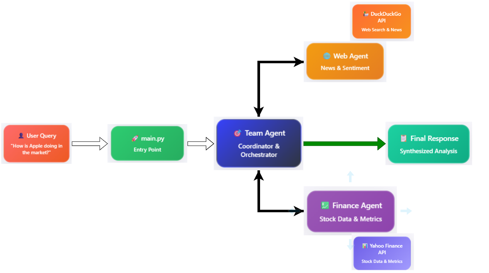

# 📊 Market Analyzer

This project uses a multi-agent system powered by [agno](https://pypi.org/project/agno/) to analyze real-time market and financial trends using:

- Web search via DuckDuckGo
- Financial data from Yahoo Finance (yfinance)
- LLM-powered coordination via `Ollama` or `Google Gemini`

---
## 🧠 How It Works – High-Level Framework


---

## 📁 Project Structure

```
market-analyzer/
├── agents/
│   ├── web_agent.py
│   ├── finance_agent.py
│   └── team_agent.py
├── config/
│   ├── __init__.py
│   └── settings.py
├── tests/
│   ├── __init__.py
│   └── test_agents.py
├── .github/
│   └── workflows/
│       └── ci.yml
├── Dockerfile
├── docker-compose.yml
├── requirements.txt
├── .env.example
├── .gitignore
├── Makefile
├── main.py
└── README.md
```

---

## 🚀 Quick Start

### ▶️ Run with Python

```bash
# 1. Install dependencies (requires Python 3.12.8)
pip install -r requirements.txt

# 2. Run analysis
python main.py --query "What are the current trends in the semiconductor market?"

## More Examples
python main.py --query "How is Apple doing in the market?"
python main.py --query "What's happening with banking stocks?"
python main.py --query "Are electric vehicle companies performing well?"
python main.py --query "What are the trends in cryptocurrency?"
python main.py --query "How is the real estate market?"

# 3. Run tests
pytest
```

### 🛠️ Developer Shortcuts

Use the included `Makefile`:

```bash
make run    # Run the app with a default query
make test   # Run all tests
make lint   # Lint the code (if flake8 is installed)
```

### 🐳 Docker Support

Run the entire app in a containerized environment:

```bash
docker-compose build
docker-compose up
```

This uses:
* `python:3.12.8-slim` as the base image
* `OLLAMA_MODEL` as an environment variable (see `.env.example`)

---

## ✅ Python Version

This project uses and expects **Python 3.12.8**.

For consistent results, make sure to use the same version locally, in Docker, and in CI.

---

## 🔧 Model Configuration
This project supports two different LLM providers for its AI-powered analysis:

### 1. Ollama Model (Local CPU):

- Configured for local execution using Ollama on Windows systems.
- To use this model, ensure the following line is uncommented in config/settings.py:

```bash 
model_config = Ollama(id=os.getenv("OLLAMA_MODEL"), provider="Ollama")
```

- Make sure to set the OLLAMA_MODEL variable in your .env file.
### 2. Google Gemini Model:

- Configured for cloud-based execution using Google AI Studio.
- To use this model, uncomment and configure the following lines in config/settings.py:
```bash
os.environ["GOOGLE_API_KEY"] = os.getenv("GEMINI_API_KEY")
model_config = Gemini(id=os.getenv("GEMINI_MODEL"), provider="Google")
```
- Ensure your .env file contains the GEMINI_API_KEY and GEMINI_MODEL variables.
Refer to the .env.example file for environment variable configuration details.
- We have used `OLLAMA_MODEL=qwen2.5:3b` and `GEMINI_MODEL=gemini-2.0-flash` in our case.

---

## 📈 Example Outputs

Want to see how this system responds to real-world queries?

Check out:  
[`examples/output_samples.md`](examples/output_samples.md)

This includes responses from both:
- Ollama `qwen2.5:3b`(local LLM via CPU)
- Google Gemini `gemini-2.0-flash` (cloud-based via Free API Key)


Sample queries include:
- "How is Apple doing in the market?"
- "Are electric vehicle companies performing well?"
- "What are the trends in cryptocurrency?"


## 🧪 Continuous Integration

GitHub Actions will:
* Install dependencies
* Run all unit tests (`pytest`)

Workflow config is located in `.github/workflows/ci.yml`.

---

## 📄 License

MIT

## 🔗 References

[AI Agents in 5 Levels of Difficulty (with Full Code Implementation)](https://medium.com/data-science-collective/ai-agents-in-5-levels-of-difficulty-with-full-code-implementation-15d794becfb8) 


