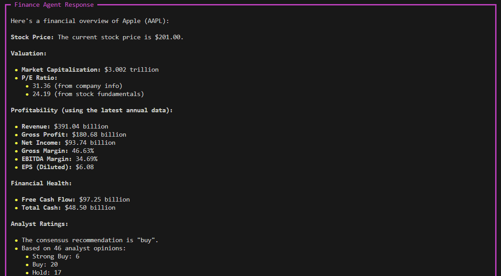

## 1 a). How is Apple doing in the market? [`gemini-2.0-flash`]

#### `FINAL RESPONSE`

## 1 b). How is Apple doing in the market? [`ollama qwen2.5:3b`]

## 2 a). Are electric vehicle companies performing well?[`gemini-2.0-flash`]
### `Below is just Final RESPONSE:`

## 2 b). Are electric vehicle companies performing well?[`ollama qwen2.5:3b`]
### `Below is just Final RESPONSE:`

## 🔍 Observation
As we can see, the responses generated using `Gemini 2.0 Flash` are far more comprehensive, structured, and visually informative than those from `Qwen 2.5 3B`. This difference is expected given the size and capability gap between these two models. Gemini demonstrates better summarization, chart insight interpretation, and final conclusions, especially in multi-agent coordination scenarios.
